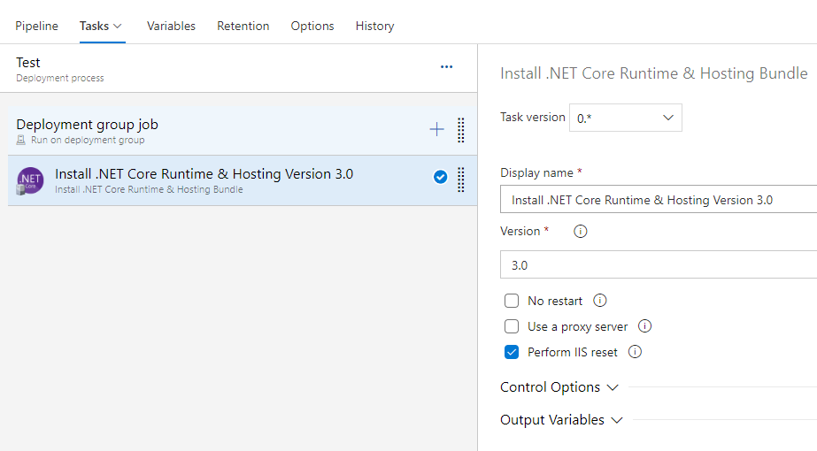

# Install .NET Core Runtime & Hosting Task

Azure DevOps pipeline task that downloads and installs the latest .NET Core runtime and hosting bundle.

## Supported .NET Core versions
- 2.1
- 2.2
- 3.0

## YAML snippet
```yaml
# Install .NET Core Runtime & Hosting Bundle
# Install the .NET Core runtime and hosting bundle
- task: InstallNetCoreRuntimeAndHosting@1
  inputs:
    #version: '3.0' # Options: 2.1, 2.2, 3.0
    #useProxy: false
    #proxyServerAddress: # Required when useProxy == true
    #norestart: false
    #iisReset: true
```

## Arguments

| Name | Description |
|-|-|
| `version`<br />Version | Version of .NET Core to download and install.<br />Options: `2.1`, `2.2`, `3.0` |
| `useProxy`<br />Use a proxy server | Enabling this option will make it possible to specify a proxy server address that will be used to download the installer. |
| `proxyServerAddress`<br />Proxy server address | The URL of the proxy server to use when downloading the installer. Needs to include the port number.<br />Example: `http://proxy.example.com:80` |
| `norestart`<br />No Restart | Enabling this option will pass the `/norestart` argument to the installer to suppress any attempts to restart. |
| `iisReset`<br />Perform IIS reset | Enabling this option will reset IIS after installation.<br />The reset is recommended for all changes to take effect. |

## Examples

1. Install the [Install .NET Core Runtime & Hosting Bundle](https://marketplace.visualstudio.com/items?itemName=rbosma.InstallNetCoreRuntimeAndHosting) extension from the Marketplace in your Azure DevOps organization.
2. Create a new release pipeline.
3. Add a deployment group job.
4. Add the `Install .NET Core Runtime & Hosting Bundle` task to the deployment group job.
5. Configure the version you want to install.  
   
   

## Q & A

### How does it work?

The task wraps a PowerShell script that:
1. Retrieves the latest available .NET Core version from the appropriate `releases.json`, like https://dotnetcli.blob.core.windows.net/dotnet/release-metadata/3.0/releases.json.
2. Looks in the `releases.json` for the download URL of the .NET Core Runtime & Hosting bundle installer (`dotnet-hosting-win.exe`).
3. Downloads the installer.
4. Executes the installer.
5. Uploads any logs created by the installer.
6. Performs an IIS reset if specified.

The task does not use PowerShell remoting so it will download and install .NET Core on the server where the task is run.

### Does it uninstall older versions of .NET Core?

No.

### What to do when I get an error downloading the installer?

In some cases you might get an error like the one below because the task is unable to download the installer. 

```
Load release data from: https://dotnetcli.blob.core.windows.net/dotnet/release-metadata/3.0/releases.json
Exception calling "DownloadString" with "1" argument(s): "The underlying connection was closed: An unexpected error occurred on a receive."
At C:\azagent\A1\_work\_temp\39753a3f-3f3e-4351-b612-3d286ccd9f29.ps1:20 char:5
+     $releases = $webClient.DownloadString($releasesJSONURL) | Convert ...
```

There are several reasons that might cause an error like this to occur:
- The site `https://dotnetcli.blob.core.windows.net`, with the releases.json that has the download URL for the installer, is not a trusted site.
- The site `https://download.visualstudio.microsoft.com/`, where the installer is hosted, is not a trusted site.
- The server does not have outgoing internet access.

Depending on the reason adding a site to the trusted sites might do the trick.

## Open source

This task is open source [on GitHub](https://github.com/ronaldbosma/InstallNetCoreRuntimeAndHostingTask). Feedback and contributions are welcome.